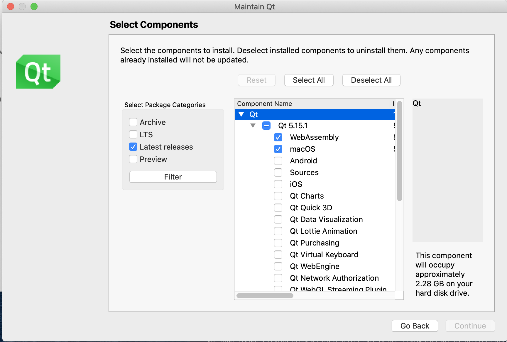
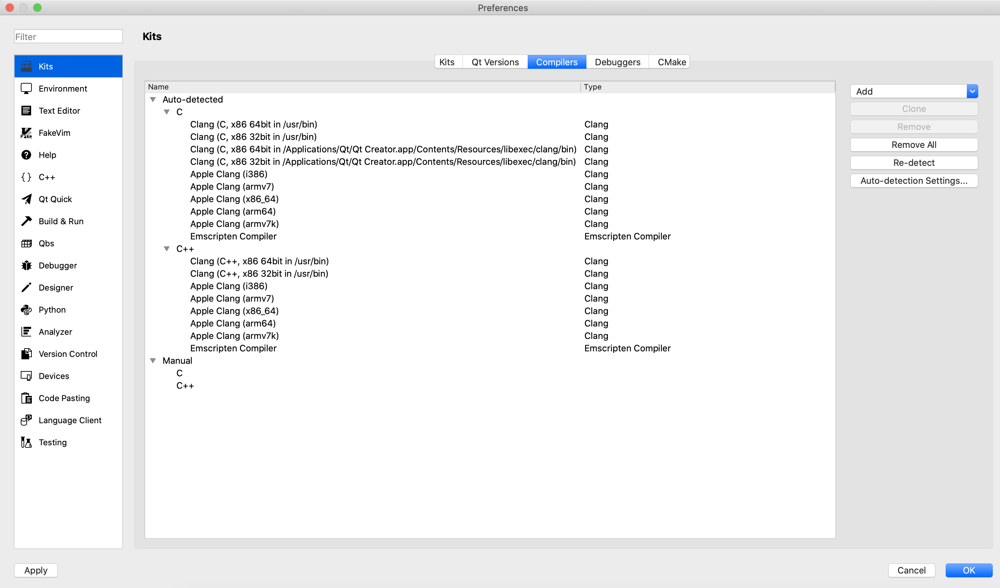
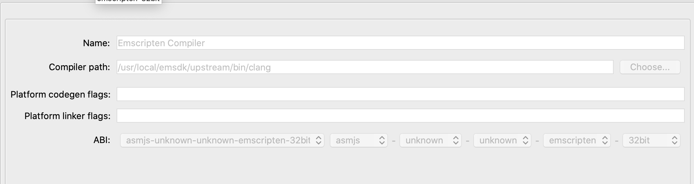
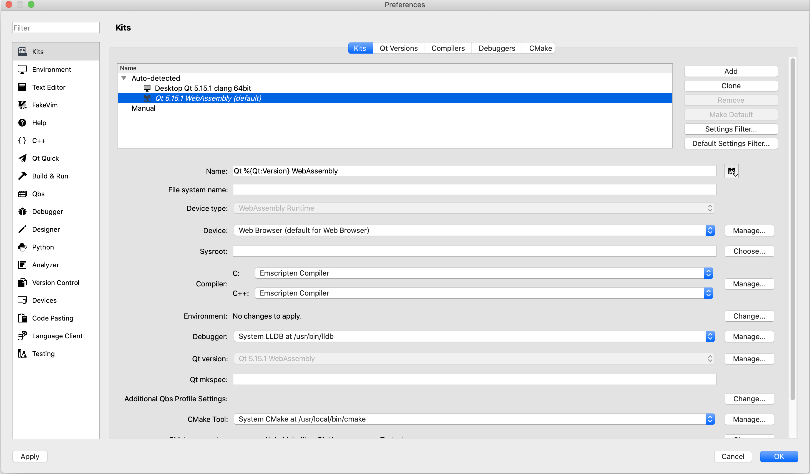

# QtWeb-Tutorial
This is me figuring out how to get Qt working with WebAssembly, and then sharing the info with others. I encourage you to read this entire README before doing anything, so you have perspective.

There are two Qt projects under this project:

* Server -- implement a C++ REST interface. This is non-Qt, although I use Qt Creator as my IDE.
* Client -- implement a demo order entry system. This is a Qt WebAssembly app.

This project is tested to build under Mac. You don't necessarily need all these steps in general, but you do to build and run this demo.

1. Install and configure nginx and postgresql.
2. Install some libraries.
3. Install Qt (see below)
4. Install emscripten
5. Run and configure Qt
6. Build

# nginx
The app in question is a WebAssembly app that runs on the browser and a C++ server app that runs wherever you run it. However, WebAssembly apps can only talk to the server from where they're loaded. For this reason, you'll need nginx.

    brew install nginx

This will take a bit of time. You then need to do a minor bit of configuration. On Mac, nginx runs out of /usr/local/etc/nginx, and there is an nginx.conf file in that directory. We need to define a proxy_pass section. This is what I did.

    mkdir /usr/local/etc/nginx/services
    cp files/DemoClient.conf /usr/local/etc/nginx/services

Then edit /usr/local/etc/nginx/nginx.conf. There's an http section. Inside the http section is a server section. Add this line to the bottom of the server section:

    include services/*;

Now, that's how I did it, but you could just as easily include the text of DemoClient.conf into that location instead.

    brew services restart nginx

# PostgreSQL
    brew install postgresql

I already have postgresql running locally, but I think you probably need to do this:

    brew services start postgresql

If you want, you can configure security however you typically manage PostgreSQL. Then:

    createuser --createdb --pwprompt webdemo

Give it the ultra-secure password of webdemo-asdf. Then run this script:

   ./CreateDB.sh

Yes, that ultra-secure password is in this script. It's just a demo. You can test it with:

    psql webdemo webdemo
    select * from users;

It will be empty (for now).

# Libraries
The server side requires:

* boost version 1.67 (yes, this is old)
* PostgreSQL and related libraries libpq and libpqxx

Boost isn't hard but takes a little time:

    cd /tmp
    wget https://sourceforge.net/projects/boost/files/boost/1.67.0/boost_1_67_0.tar.gz
    tar xzvf boost_1_67_0.tar.gz
    cd boost_1_67_0
    ./bootstrap.sh
    sudo ./b2 --with=all install

Note that this will overwrite any other boost library you may already have. Libpq comes with PostgreSQL, which you've already installed. The C++ library is here:

https://github.com/jtv/libpqxx

I'm sorry, I don't have good installation directions, but it shouldn't be hard.

# Installing and Configuring Qt
You can begin here: https://doc.qt.io/qt-5/wasm.html. However, the directions are flawed, and it took me some time to work it out, so I'm going to walk you through the entire process.

First, go to qt.io and click the big Download button. You're going to have to figure this out a little. They have you register. You can use the Open Source license.

Eventually you'll run the Qt MaintenanceTool. If you don't get a chance to do this following their original downlooad steps, at least on Mac, you can open /Applications/Qt/MaintenanceTool. It will ask you to log in. Then you can Add or Remove components. You'll get a page that looks like this:

You might want to select LTS instead, but I get the same list. Underneath the latest stable release (4.15.1 as I type this), you'll want to select WebAssembly and whatever your desktop environment is. For me, that means macOS. Don't worry; it will run under Linux, too.

Then do Continue and let it install. It will take maybe 10 minutes. When it's done, Quit the Maintenance Tool.

Don't run Qt Creator yet.

# Install Emscripten

Here's what I did:

    git clone https://github.com/emscripten-core/emsdk.git
    cd emsdk
    ./emsdk install 1.39.8
    ./emsdk activate --embedded 1.39.8

Looks good so far. This will tell you to source a file. Add to your .bashrc file (or whatever your startup script is):

    #======================================================================
    # emscripten setup
    #======================================================================
    . /usr/local/emsdk/emsdk_env.sh

Note that the activate command above creates /usr/local/emsdk/.emscripten. You need to copy this to your home directory and edit it.

It will start out looking like this:

    import os
    emsdk_path = os.path.dirname(os.environ.get('EM_CONFIG')).replace('\\', '/')
    NODE_JS = emsdk_path + '/node/12.18.1_64bit/bin/node'
    PYTHON = emsdk_path + '/python/3.7.4-2_64bit/bin/python3'
    LLVM_ROOT = emsdk_path + '/upstream/bin'
    BINARYEN_ROOT = emsdk_path + '/upstream'
    EMSCRIPTEN_ROOT = emsdk_path + '/upstream/emscripten'
    TEMP_DIR = emsdk_path + '/tmp'
    COMPILER_ENGINE = NODE_JS
    JS_ENGINES = [NODE_JS]

However, Qt needs this file, and it fails with it like this. So edit your ~/.emscripten file and make it look more like this:

    import os
    emsdk_path = '/usr/local/emsdk'
    NODE_JS = '/usr/local/emsdk/node/12.18.1_64bit/bin/node'
    PYTHON = '/usr/local/emsdk/python/3.7.4-2_64bit/bin/python3'
    LLVM_ROOT = '/usr/local/emsdk/upstream/bin'
    BINARYEN_ROOT = '/usr/local/emsdk/upstream'
    EMSCRIPTEN_ROOT = '/usr/local/emsdk/upstream/emscripten'
    TEMP_DIR = '/usr/local/emsdk/tmp'
    COMPILER_ENGINE = NODE_JS
    JS_ENGINES = [NODE_JS]

You'll want to verify that your EM_CONFIG directory is /usr/local/emsdk, but if that's where you installed it, it should be. After that, this is just a replacement of some of the text.

THIS IS THE BIG TRICK that the other directions don't tell you. There's one more trick.

# Run and Configure Qt
Qt Creator is pretty cool, but in some ways, it's not 100% of the way there. But it's better than some other tools.

You'll find Qt Creator in /Applications/Qt/Qt Creator.app. Run it.

Then go to Preferences. On Mac that means you go to the menu under Qt Creator itself and pick Preferences. Go to Kits and click on the Compilers page. It will look something like this:

You almost certainly won't have the two Emscripten Compiler lines yet, and your overall list could be dramatically different.

What you need to do is click the Re-detect button on the Right.

If it works, it will add the Emscripten Compiler options and they won't look like they have nasty-ass warnings. But if you click one, the details will grey out but look something like this:

If it looks dramatically different, then you want to review the installation of emscripten in the first place. If it says emcc or em++ instead of clang or clang++, that's even better. This is what I got.

You now need to configure the kit itself. Switch from the Compilers tab to the Kits tab and click on the WebAssembly kit to get a page like this:

What's important is that you have to make sure that the compiler settings in the middle of that say the Emscripten compiler. If so, the kit is all set. Save the changes.

# Working Within Qt

# Build from Command Line
You'll need to make sure you have GNU make and g++.

    $ make --v
    GNU Make 4.3
    Built for x86_64-apple-darwin18.7.0
    Copyright (C) 1988-2020 Free Software Foundation, Inc.
    License GPLv3+: GNU GPL version 3 or later <http://gnu.org/licenses/gpl.html>
    This is free software: you are free to change and redistribute it.
    There is NO WARRANTY, to the extent permitted by law.

    $ g++ -v
    Configured with: --prefix=/Applications/Xcode.app/Contents/Developer/usr --with-gxx-include-dir=/Applications/Xcode.app/Contents/Developer/Platforms/MacOSX.platform/Developer/SDKs/MacOSX.sdk/usr/include/c++/4.2.1
    Apple clang version 12.0.0 (clang-1200.0.32.2)
    Target: x86_64-apple-darwin19.5.0
    Thread model: posix
    InstalledDir: /Applications/Xcode.app/Contents/Developer/Toolchains/XcodeDefault.xctoolchain/usr/bin

You can run make from either of the project directories or at the top level.

# Install and Run
From the top, you can run make install. This copies the WebAssembly files into place for nginx.

You also can CD into the Server app and run DemoServer on the default port.

At this point, browse to http://localhost:8080/OrderEntry.html
